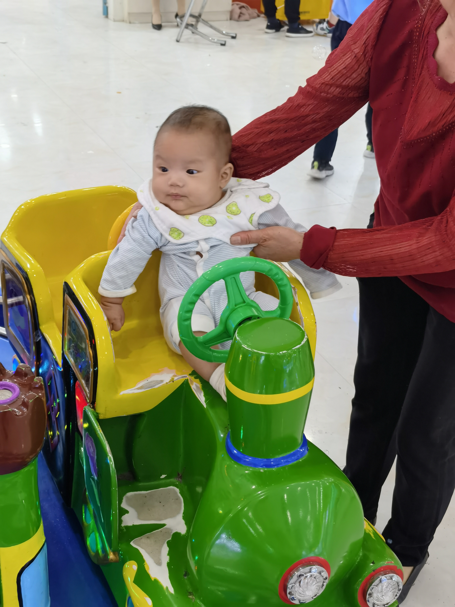

# 宝宝&猪猪の大事记

## 2018-10-14  第一次相识

我们第一次见面，是在青藤组织的活动，晚上还一起去吃了烤鱼鱼，可惜那天没拍照片。

从宝宝以前朋友圈偷偷存了两张照片，那时候的宝宝好乖乖的感脚：

还记得宝宝说：**借给你只手都不要**

现在想一想，我真是一只大笨猪 :pig:

## 2018-11-18  一起爬南山

前一天17号晚上，和宝宝一起去逛商场买衣服，好紧张呀！

我现在还记得，有一件牛仔连衣裙，好漂亮来着！

第二天我们一起去爬南山，那里好远，我第一次去，爬了好久才爬上去。在亭子里拍的照片，晚上回来地铁上发了朋友圈，和宝宝确定关系了，真高兴呀！

后面一周11月24号，专门找了一个餐厅，跟宝宝正式表白了! :heart:

第二天又一起去了仙湖植物园，被淋了个落汤鸡，还吃了一份斋饭

## 2018-12-23  一起去香港提前过圣诞

我们一起过的第一个圣诞节！

但是因为24、25号不放假，我们只好提前23去香港过圣诞啦。

我们那天是坐高铁过去的

我们那天一起在维港挂了同心锁，那时候我还是小金鱼呢！

我们还一起坐了摩天轮，一起吃了雪糕车上的雪糕

## 2019-1-1  宝马和澳门跨年

12月30号，我第一次参加了马拉松-不过是欢乐跑。宝宝那天好厉害哦！

31号，我们一起去澳门跨年啦，那天吃了蛋挞和三明治，去了大三巴，本来想看烟花但是怕回不来，提前回到了珠海

后面给宝宝过生日的时候，因为没有准备礼物和蛋糕，宝宝生气了，我真笨笨！宝宝后面不要和我这么笨的笨猪生气啦～

## 2019-2-5  回家过春节

那年春节是和宝宝一起回安徽过的，是我第一次去安徽，第一次在没和父母过年，也是第一次和宝宝过年

还记得有个车车翻到水坑里面去了

## 2019-4-4  巴厘岛之行

计划了好久的清明节巴厘岛之行，马上要开始啦！在机场，想到马上就要去巴厘岛玩，还觉得好开心呀！

### 第一天

我们去了海神庙，吃了龙虾，没有玩成滑翔伞，但是那个悬崖好美

### 第二天

和宝宝出海，海岛好美，还去了海里游泳，宝宝根本都不敢下去！

### 第三天

我们去了大秋千，去了天空之镜，宝宝那天真美！

### 第四天

巴黎岛上的日出

最后一天，我们看了巴厘岛的日出，去了乌布市场，还有捣乱的小猴子！

巴厘岛真美阿，而且性价比真高，以后有机会，我们一起再去一次巴厘岛吧！

## 2019-6-23  和宝宝过的第一个生日

六月份，我们一起走了麦径

还和宝宝一起过了第一个生日，好幸福呀

## 2019-9-14  爬武功山

七月份的时候，我们一起去拍了情侣照，宝宝真漂亮！

中秋节，我们一起去爬了武功山，蹄蹄都要断了！

## 2019-10-1  拍婚纱照

9月份，我们去一人一像拍了结婚证件照

十一，我们回青岛拍婚纱照，我们马上就要结婚啦！

不过这个婚纱照拍的不够好，天天宣传的伯爵旅拍，真臭

## 2019-10-14  领结婚证

10月12号，我想了好久想到的求婚方案，宝宝竟然提前发现了，早知道当时就不提前透露了！

然后14号，我们认识一周年纪念日，我们结婚啦！

记得我那天念誓词的时候，哭得好厉害，我也不知道为什么，就是觉得好幸福～

## 2019-10-19  香港迪士尼

趁着香港废青闹事，香港没有人去，又正好是万圣节，我们一起去了迪士尼，发现迪士尼有好多小猪猪哦！以后我们也要带我们小猪猪来玩！

## 2020-1-5  普吉岛婚礼

终于要到婚礼了，我和宝宝的爱情长跑（短跑？），马上要迎来终点啦！

30号晚上，我们坐飞机到了普吉岛。后面这几天，我们去了皇帝岛、普及大佛/查龙寺、斯米兰岛、攀牙湾，看了人妖，去了免税店

然后1月5号，就到了我们的婚礼啦！那天的海边日落真美，但是和宝宝比起来差远啦！

可惜我手机和电脑里，存的泰国照片太少了，大部分照片都在宝宝手机里，但是我又不能提前告诉宝宝。等宝宝看到了这里，如果想的话，把你手机里面的照片也加进来吧～

## 2020-1-24  春节回家

hard模式的2020年，马上要开始了，就从春节开始！

我们开车10多个小时，从深圳回家里，路上就一直看到武汉疫情的新闻，听说了武汉春节封城的消息。当时真是怕死了，感觉像是SARS又来了，而且离得好近！

春节每天都有好多新闻出来，每天都关注疫情，本来春节期间的婚礼酒席也取消了。不过事后新冠肺炎闹的这么厉害，后面想想，幸亏取消了，要不搞不好要被隔离，要是再得了新冠，就更不得了了！

另外，这几天好像都没有拍照诶～

## 2020-5-1  五一游桂林

春节以后几个月，因为新冠越来越厉害，我们基本都宅在家里。本来决定的日本游，也泡汤了～

好不容易到了五一，终于决定出去玩一趟-桂林自驾游！

虽然桂林也很漂亮，但是和预期的日本相比，心里预期差距还是挺大的。以后有机会再去日本吧！

## 2020-10-1  十一游广州

这几个月，因为疫情和怀了小猪猪的原因，我们好像都没怎么出去玩，十一去了一趟广州+顺德+珠海，感觉好玩的不多，好吃的很多！

## 2020-10-14  结婚一周年

转眼间，已经和宝宝认识两周年，结婚一周年啦！那天也是深圳特区成立40周年，我们在海底捞吃了好多肉肉～

## 2020-12-23  拍孕妇照

小猪猪已经马上要出来啦，我觉得一定是一只小母猪！和宝宝一起去拍了圣诞照和孕妇照，不知道以后小猪猪会不会看到～

## 2021-01-18  小猪猪出生啦！

千呼万唤下，小猪猪终于出生啦！

我们家小猪猪，肯定很心疼麻麻，出来的这么快，都没有别人开三指的痛苦，一下开到八指，一个小时就出生了，小猪猪真厉害！

现在看当时的小猪猪，脸又皱又黑，眼睛突，真像小老头，哈哈哈

不过，后面小猪猪就张胖了，也白了，变成了一直白胖猪

## 2021-04-28  小猪猪100天 & 回老家

五一到了，小猪猪100天大了，100天的小猪，越发像一只胖猪猪了。

而且，麻麻和小猪猪就要回老家了，要去一个月！这是我和宝宝认识以后，分开最长的时间，太难受了！以后我再也不要和宝宝分开这么久了！

## 2021-09-05  大鹏两日游

这应该是有小猪猪以后，我们第一次一起在外面过夜。可惜，我手机里只有一点这几天的照片，我们去了校场尾、看了海滩，还去了佳兆业国际乐园，被晒惨了！

## 2021-10-01  十一广州游

十一，我们在深圳给杨翼航过了生日，然后去广州玩了三天，这是我们有小猪猪以后，去的最远的一次旅游

我们去了北京路、沙面、夜游珠江，还去了长隆动物园、儿童公园！

## 2021-10-14  结婚两周年

一转眼，就和宝宝认识三周年、结婚两周年啦！

这三年来，从认识宝宝、确定关系、领证、生小猪，感觉时间过的好快；但是仔细一想，感觉又经历了好多，感觉回忆满满。也许，这就是中年人的生活吧！

今后，还要和宝宝生活一辈子，希望宝宝能多容忍我这只又懒，又爱吃肉肉，又爱拉屎放屁，睡起觉来还像是只死猪的猪猪。在我心里，小猪猪只能排第二名，宝宝永远排第一名！（别告诉小猪猪）

